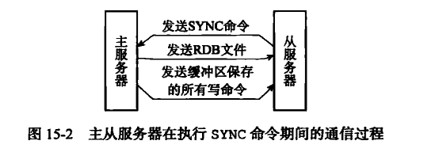
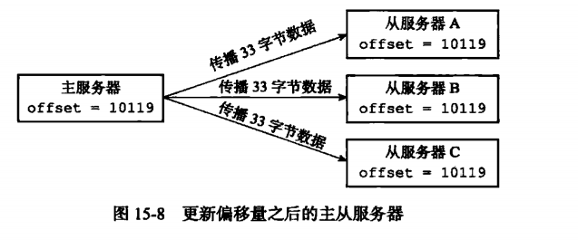
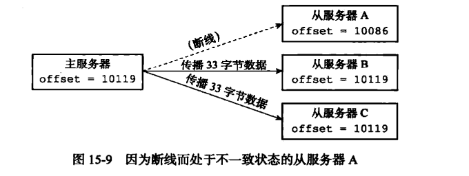
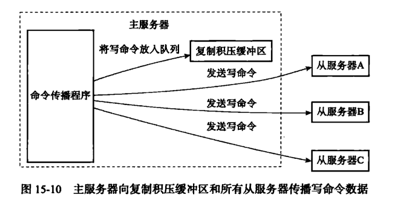
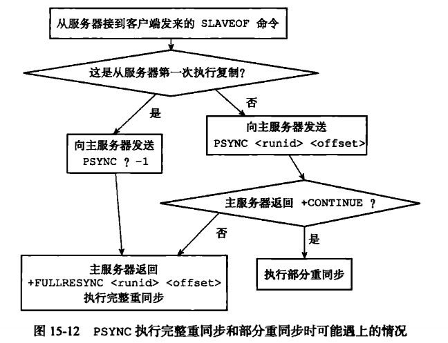
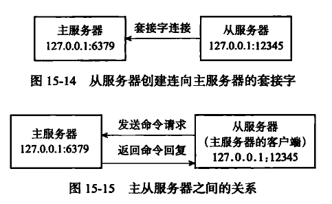
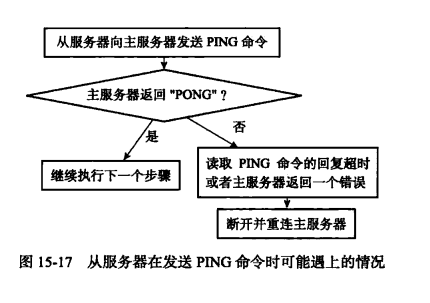
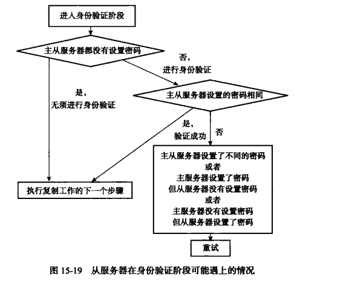

## 复制
　　在 Redis 中，通过执行 SLAVEOF 命令或设置 slaveof 选项，将一个服务器的数据复制到另一个服务器。

### 旧版复制功能的实现（Redis 2.8版本之前的）
　　Redis 的复制功能分为同步（sync）和命令传播（command propagate）两步。

#### 同步

- 从服务器向主服务器发送 SYNC 命令；
- 收到 SYNC 命令的主服务器执行 BGSAVE 命令，在后台生成 RDB 文件，并使用缓冲区来记录从现在开始执行的所有命令；
- 当主服务器的 BGSAVE 命令执行完后，主服务器将 BGSAVE 命令生成的 RDB 文件发给从服务器，从服务器接收并载入 RDB 文件，更新数据库状态至主服务器执行 BGSAVE 命令时的数据库状态；
- 主服务器将记录在缓冲区的里的所有写命令发送给从服务器，从服务器执行这些写命令，将数据库状态更新至主服务器数据库当前所处的状态。

　　简单概括，主服务器生成 RDB 文件保存了数据库状态，从服务器读取 RDB 文件更新数据库状态。在生成 RDB 文件期间的命令都存在缓冲区，当完成 RDB 文件生成后，在将这期间的写命令发送给从服务器，更新数据库状态。
  


#### 命令传播
　　当同步完成后，主服务器在执行新的写命令时，会将该写命令发给从服务器，这样主从服务器就能保持一致。

### 旧版复制功能缺陷
　　从服务器对主服务器的复制分为两种情况。

- 初次复制，从服务器以前没有复制过任何主服务器，或者从服务器当前要复制的服务器和上一次复制的主服务器不同；
- 断线后重复制，处于命令传播阶段的主从服务器因为网络原因而中断了复制，但从服务器通过自动连接重新连上主服务器，并继续复制主服务器。

　　旧版缺陷在于断线后的重复制，假设前一千个写命令通过命令传播，主从服务器都保持一致。这时主从服务器连接断开，从服务器接收不到主服务器发送过来的写命令。等重新连上后，已经错失了主服务器的三个写命令。<br />
　　于是从服务器向主服务器发送同步命令，主服务器会生成包含从第 1 个到第 1003 命令的 RDB文件。因为错失三个命令，而生成 1003 个 RDB 文件是非常低效的，而同步（SYNC）命令是非常耗费资源的操作。

### 新版复制功能的实现
　　Redis 从 2.8 版本开始，使用 PSYNC 命令代替 SYNC 命令来执行同步操作。PSYNC 有两种同步模式，完整重同步和复制重同步。

- 完整重同步，用于处理初次复制的情况，和 SYNC 命令执行流程一样；
- 部分重同步，用于处理断线后重复制情况。当从服务器在断线后重连主服务器时，如条件允许，主服务器可将主从服务器连接断开期间执行的写命令发送给从服务器，无需生成 RDB 文件，解决了旧版低效问题。


### 部分重同步的实现

#### 复制偏移量
　　执行复制的双方，主服务器和从服务器会分别维护一个复制偏移量：

- 主服务器每次向从服务器传播 N 个字节的数据时，主服务器的复制偏移量 + N；
- 从服务器每次收到主服务器传播过来的 N 个字节的数据时，从服务器的复制偏移量 + N。



　　通过对比主从服务器的复制偏移量，就能知道主从服务器是否处于一致状态。如下，当从服务器 A 处于断线时，复制偏移量不再增加，与主服务器的复制偏移量不一致。
  


#### 复制积压缓冲区
　　复制积压缓冲区是由主服务器维护的一个固定长度先进先出队列，默认大小为 1MB。和普通队列区别在于，固定长度先进先出队列的长度是固定的，当元素数量大于队列长度时，最先入队的元素会被弹出。<br />
　　当主服务器进行命令传播时，不仅会将写命令发送给所有从服务器，还会将写命令入队到复制积压缓冲区里。如下图：
  


　　因此，主服务器的复制积压缓冲区里会保存一部分最近传播的写命令，并且复制积压缓冲区会为队列中的每个字节记录相应的复制偏移量。当从服务器重新连上主服务器时，通过 PSYNC 命令将从服务器的复制偏移量 offset 发送给主服务器，主服务器根据这个复制偏移量来决定对从服务器执行哪种同步操作：

- 如果 offset 偏移量之后的数据，仍存在于复制积压缓冲区，则进行部分重同步操作，将 offset 之后的写命令发给从服务器；
- 如果 offset 偏移量之后的数据不再复制积压缓冲区，则进行完整同步操作，主服务器生成 RDB 文件。

　　复制积压缓冲区的大小是可调整的，根据公式 second * write_size_per_second 来估算，second 表示从服务器断线后重新连上主服务器所需的平均时间，write_size_per_second 则是主服务器平均每秒产生的写命令数量。

#### 服务器运行 ID
　　每个 Redis 服务器都有自己的运行 ID，在服务器启动时自动生成，由 40 个随机的十六进制字符组成。<br />

- 从服务对主服务器进行初次复制时，主服务器会将自己的运行 ID 发给从服务器，让从服务器保存这个 ID；
- 当从服务器断线并重新连上一个主服务器时，从服务器将向当前连接的主服务器发送之前保存的运行 ID；
- 通过比较 ID，确认当前连接的主服务器和之前断线的是同一个，则尝试执行部分重同步；
- 不一致，则执行完整同步。

#### 总结部分重同步流程

- 主服务器会把自己的运行 ID 发给从服务器，从服务器保存这个运行 ID；
- 断开连接后又重新连上时，从服务器需使用运行 ID 来确认连接上的主服务器是否是之前断开的；
- 如果是的话，则在对比复制偏移量差了主服务器的复制偏移量多少，然后确认复制积压缓冲区是否有存储，有存储则使用部分重同步；
- 不是同一台主服务器，或是复制积压缓冲区没有存储，则使用完整同步，生成 RDB 文件。



### 复制的实现

#### 步骤1，设置主服务器的地址和端口
　　当客户端向从服务器发送 SLAVEOF 命令时，从服务器会将客户端给定的主服务器 IP 地址 127.0.0.1 以及端口 6379 保存到服务器状态的 masterhost 属性和 masterport 属性里：
  
```redis
127.0.0.1:12345> SLAVEOF 127.0.0.1 6379
OK
```

　　SLAVEOF 命令是一个异步命令，在完成 masterhost 属性和 masterport 属性的设置后，从服务器将向发送 SLAVEOF 命令的客户端返回 OK，表示复制指令已经被接收，而实际的复制工作将在 OK 返回之后才开始执行。

#### 步骤2，建立Socket 连接
　　执行 SLAVEOF 命令后，从服务器根据命令所设置的 IP 地址和端口，创建连向主服务器的套接字连接。连接成功，则从服务器为套接字关联一个专门用于处理复制工作的文件时间处理器，该处理用于接收 RDB 文件，接收主服务器传播来的写命令。<br />
　　而主服务器在接受从服务器的套接字连接后，将为该套接字创建相应的客户端状态，并将从服务器看作是一个连接到主服务器的客户端来对待，这时从服务器将同时具有服务器和客户端两个身份，即从服务器是主服务器的客户端，从服务器可以向主服务器发送命令请求（如同步命令），主服务器则向从服务器返回命令回复。
  


#### 步骤3，发送 PING 命令
　　从服务器成为主服务器客户端后，会向主服务器发送一个 ping 命令，用于检查套接字的读写是否正常（网络连接是否正常）和主服务器能否正常处理命令请求。下图为从服务器发送 ping 命令时可能遇到的情况：
  


#### 步骤4，身份验证
　　从服务器收到主服务器返回的“PONG”回复后，根据从服务器是否设置了 masterauth 选项来决定是否进行身份验证。需要验证，则发送一条 AUTH 命令，命令的参数为从服务器选项 masterauth 的值。



#### 步骤5，发送端口消息
　　身份验证完后，从服务器将执行命令 REPLCONF listening-port <port-number>，向主服务器发送从服务器的监听端口号。
  


#### 步骤6，同步
　　从服务器向主服务器发送 PSYNC 命令，执行同步操作，将从服务器的数据库状态更新至主服务器当前的数据库状态。在同步操作执行之前，只有从服务器是主服务器的客户端，这样从服务器才能给主服务器发送 PSYNC 命令。同步操作后，主服务器也会成为从服务器的客户端，只有这样，主服务才能向从服务器发送命令，如是完整重同步操作，则主服务器会将保存在缓冲区里面的写命令发送给从服务器执行。而部分重同步操作，则将发送保存在复制积压缓冲区的写命令。<br />
　　同步操作后，主从服务器双方都是对方的客户端，可互相发送命令请求，或互相返回命令回复。而且只有主服务器称为从服务器的客户端，才能
执行命令传播。


#### 步骤7，命令传播
　　完成同步操作后，主服务成为从服务器的客户端，会将主服务器的写命令发送给从服务器，保证主从服务器的数据库状态一致。

### 心跳检测
　　在命令传播阶段，从服务器默认以每秒一次，向主服务器发送命令：REPLCONF ACK <replication_offset>，其中 replication_offset
是当前从服务器的复制偏移量。REPLCONF ACK 命令作用：

- 检测主从服务器的网络连接状态。如果主服务器超过一秒钟没接收到从服务器发送的 REPLCONF ACK 命令，则连接出问题。通过向主服务器发送 INFO replication 可查看相应的从服务器向主服务器发送 REPLCONF ACK 命令过去多久，用 lag 表示延迟值；
- 辅助实现 min-slave 选项。Redis 的 min-salves-to-write 和 min-savles-max-lags 这两个选项用于防止主服务器在不安全情况下执行写命令。比如 min-salves-to-write 3、min-savles-max-lags 10 表示从服务器数量不少于 3 个，并且三个服务器的延迟值 lag 大于等于10秒，则主服务器将拒绝执行写命令； 
- 检测命令是否丢失。如果因为网络故障，主服务器传播给从服务器的命令在半路消失，那么当从服务器向主服务器发送 REPLCONF ACK <replication_offset> 命令时，主服务器发现从服务器的偏移量 replication_offset 与自己的不一致，则主服务器会根据从服务器提交的复制偏移量，在复制积压缓冲区里找到从服务器缺少的数据，并将这些数据重新发给从服务器。注意，主服务器向从服务器补发缺失数据与部分重同步原理相似，但区别在于补发缺失数据是在主从服务器没有断线的情况下，而部分重同步是在断线后重新连上才执行的。
